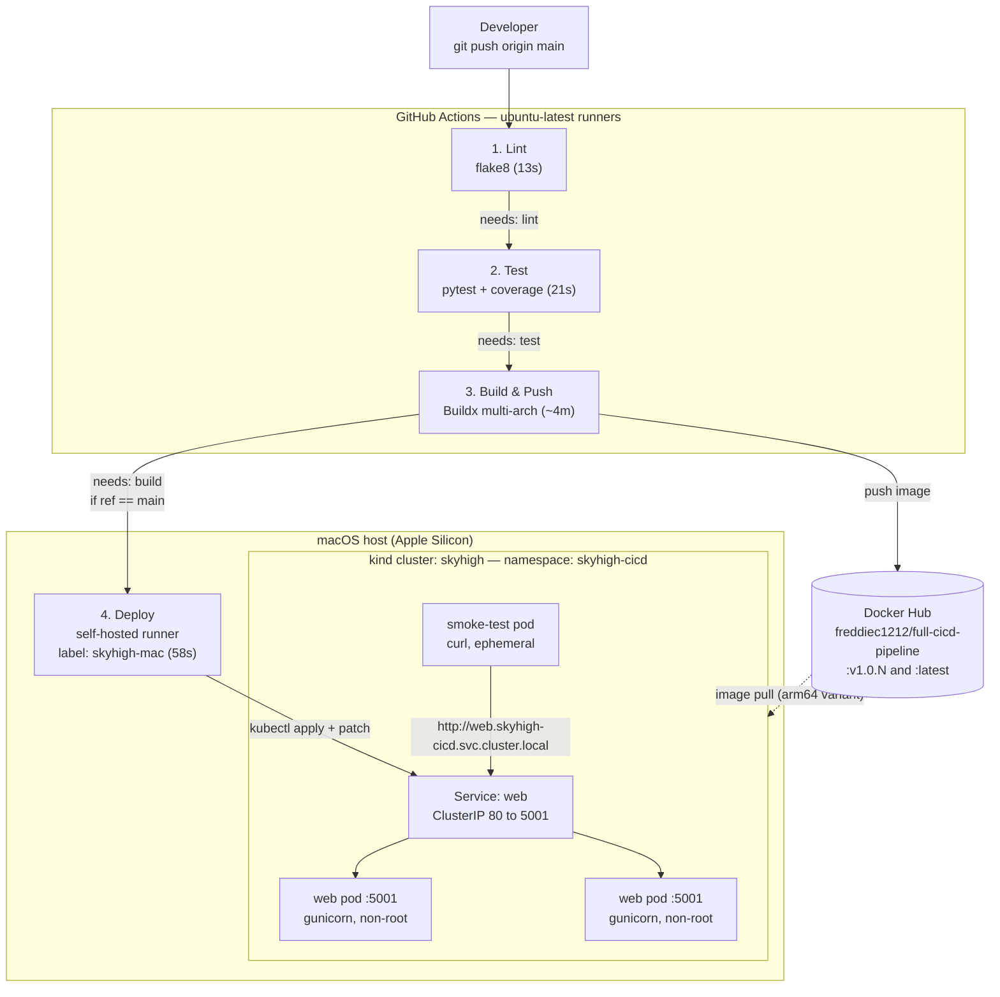

# SkyHigh Portfolio Project 04 — Automate Everything: A Full CI/CD Pipeline

[](https://github.com/freddie-c/Skyhigh-Portfolio-Project-04-Automate-A-Full-CICD-Pipepline/actions/workflows/ci.yml)
[](https://hub.docker.com/r/freddiec1212/full-cicd-pipeline)
[](#proof-of-production)
[](#proof-of-production)

## Project Description

I replaced a manual SSH-and-pray deployment process with a fully automated GitHub Actions pipeline: every push to `main` lints the code, runs a gated test suite with a coverage floor, builds a multi-architecture Docker image, publishes it to Docker Hub with an immutable version tag, and performs a zero-downtime rolling deploy to a live Kubernetes cluster — finishing with an in-cluster smoke test against the running Service.

**The scenario:** A startup's dev team ships by SSHing into a server, pulling code, and restarting the app by hand. It takes hours, breaks often, and tests run inconsistently. The mandate: *code-to-deploy in under 10 minutes, tests must pass before anything goes out, every deployment leaves an audit trail, no more manual SSH.*

**Result:** ~6 minutes end to end, four quality gates, zero credentials stored for cluster access, and a running pod that reports the exact pipeline run that built it.

**Built with:** Python/Flask · gunicorn · pytest + coverage · flake8 · Docker Buildx (multi-arch) · Docker Hub · GitHub Actions · self-hosted runner · Kubernetes (kind)

---

## What You'll Learn

- Structure a multi-job GitHub Actions workflow where `needs:` creates real quality gates — a failure at any stage physically prevents everything downstream from running
- Understand why every job is a **separate ephemeral VM**: `needs:` shares success/failure, never state, packages, or files
- Enforce a coverage floor (`--cov-fail-under=90`) so coverage is a gate, not decoration — and know which uncovered lines are acceptable
- Solve the **architecture mismatch** that breaks Apple Silicon clusters: `ubuntu-latest` runners are amd64, kind on an M-series Mac is arm64, and a single-arch image dies with `exec format error`
- Publish an OCI **manifest list** with QEMU + Buildx so one tag serves the right binary to every platform, complete with SBOM and provenance attestations
- Reach a cluster that has no public IP by using a **self-hosted runner** that dials out over HTTPS — no port forwarding, no exposed API server, no kubeconfig secret
- Use `if: github.ref == 'refs/heads/main'` as both a deployment-correctness rule *and* a security control that keeps pull requests off your machine
- Version artifacts immutably with `v1.0.${{ github.run_number }}` and close the audit loop by injecting the tag into the app as `APP_VERSION`
- Apply a strategic merge patch to update image and environment in **one** API call, triggering one rolling update instead of two
- Prove a Service actually serves traffic with an in-cluster smoke test, rather than trusting `rollout status` alone
- Recognize which config formats support trailing comments (YAML structure, Python, TOML, shell) and which silently or loudly do not (Dockerfile, INI, ignore files, YAML block scalars)

---

## Proof of Production

**1. Full pipeline green**


*All four jobs succeeded on a push to `main`: Lint → Test → Build & Push → Deploy. The connecting arrows are the `needs:` chain rendered by GitHub — the dependency graph comes straight from the YAML.*

**2. Quality gate blocking a bad commit**


*An intentionally failing test on a pull request. Test failed, so **Build and Deploy show as skipped, not failed** — they never booted a VM and never ran a line of code. No image was built, so nothing could reach Docker Hub or the cluster. This is the gate working exactly as designed.*

**3. Multi-architecture manifest list**


*`docker buildx imagetools inspect` showing one tag resolving to both `linux/amd64` and `linux/arm64`, plus two attestation manifests carrying SBOM and provenance data. The kind node pulls the arm64 variant automatically.*

**4. Self-hosted runner executing the deploy**


*The runner on my MacBook picked up the deploy job and completed it in 58 seconds. GitHub dispatched the job over a connection the runner initiated outbound — nothing inbound was ever opened.*

**5. Audit trail closed end to end**


*A live `curl` against the Service returns `"version": "v1.0.4"` — the exact GitHub run number that built the running code. Run number → workflow run → commit → author. That is the audit trail, observable rather than documented.*

**6. Zero-downtime rolling update**


*Pod ages ten seconds apart, both `1/1 READY`, zero restarts. With `maxUnavailable: 0`, Kubernetes brought up a replacement, waited for its readiness probe, and only then terminated an old pod — never fewer than two serving.*

---

## Architecture



**Pipeline flow:**

1. A developer pushes to `main` (or opens a PR against it).
2. **Lint** runs `flake8` with `max-complexity=10`. Any finding exits non-zero and stops the pipeline here.
3. **Test** runs `pytest` with `--cov-fail-under=90`. Four tests plus a coverage floor; either failing stops the pipeline.
4. **Build** sets up QEMU and Buildx, logs into Docker Hub with repository secrets, and builds for `linux/amd64` and `linux/arm64`. Pull requests build to verify but **do not push** — only real pushes publish.
5. Images publish as `:v1.0.<run_number>` (immutable) and `:latest` (convenience pointer, never deployed from).
6. **Deploy** runs only on `main`, only on the self-hosted runner. It verifies the kubectl context, applies the namespace first, applies the manifests, then issues a single strategic merge patch setting both the image tag and `APP_VERSION`.
7. Kubernetes performs a rolling update with `maxUnavailable: 0` — a new pod must pass its readiness probe before an old one is terminated.
8. A throwaway `curl` pod resolves the Service through cluster DNS and hits the app. A non-2xx response fails the step and fails the deploy.

---

## Prerequisites

| Tool | Version used | Install |
| --- | --- | --- |
| macOS (Apple Silicon) | — | — |
| Docker Desktop | with Buildx | [docker.com](https://www.docker.com/products/docker-desktop/) |
| kind | cluster `skyhigh` | `brew install kind` |
| kubectl | matching cluster | `brew install kubectl` |
| Python | 3.11 (host venv and container) | `brew install python@3.11` |
| actionlint | workflow validation | `brew install actionlint` |
| Docker Hub account | free tier, public repo | [hub.docker.com](https://hub.docker.com) |
| GitHub Actions runner | self-hosted, label `skyhigh-mac` | Repo → Settings → Actions → Runners |

No AWS account required — this project runs entirely locally and on GitHub's free tier.

**Required repository secrets:**

| Secret | Value |
| --- | --- |
| `DOCKER_USERNAME` | Docker Hub username |
| `DOCKER_PASSWORD` | Docker Hub **access token**, Read & Write scope — never the account password |

---

## Tech Stack

| Technology | Role in this project | Why I chose it |
| --- | --- | --- |
| GitHub Actions | The pipeline itself | Native to the repo, free for public repos, and `needs:` gives real dependency gating without extra infrastructure |
| flake8 | Lint stage | Configurable strictness; `max-complexity=10` catches over-branched functions, not just formatting |
| pytest + pytest-cov | Test stage | Flask's `test_client()` dispatches requests in-process — no container, no port, tests finish in under a second |
| Docker Buildx + QEMU | Multi-arch build | Emulation lets an amd64 runner produce arm64 images so one tag works on both my Mac and any Linux host |
| Docker Hub | Public registry | kind pulls public images with zero auth config; the public repo doubles as a portfolio artifact (ECR is the production answer) |
| gunicorn | Production WSGI server | Flask's dev server is single-threaded and warns against production use; gunicorn also handles SIGTERM properly for clean rolling updates |
| Self-hosted runner | Deploy target | A GitHub-hosted VM cannot route to a kind cluster behind home NAT; the runner dials out, so nothing inbound is ever exposed |
| kind | Local Kubernetes | Free, disposable, runs the real Kubernetes API as Docker containers |
| Strategic merge patch | Image + env update | Updates both fields in one API call, producing one rolling update instead of two consecutive ones |

---

## Security Decisions

| What I did | What it prevents |
| --- | --- |
| `permissions: contents: read` at workflow level | The default `GITHUB_TOKEN` has broad write scope. If a compromised dependency ran code in a runner, this is the difference between "it read public code" and "it pushed commits and created releases" |
| Docker Hub **access token** with Read & Write (not Read/Write/Delete) | A leaked token could publish images but could not destroy existing repositories |
| `if: github.ref == 'refs/heads/main'` on the deploy job | A pull request's ref is `refs/pull/N/merge`, so no PR — including from a fork — can ever schedule work on my laptop. Doubles as the deployment-correctness rule |
| "Require approval for all outside collaborators" on fork PR workflows | Defense in depth: even if the `if:` condition were edited carelessly, fork PRs still cannot execute on the self-hosted runner |
| Self-hosted runner run in the **foreground**, not as a service | The runner only accepts jobs while I am actively working and watching it; a background LaunchDaemon would listen 24/7 |
| Zero cluster credentials stored in GitHub | The runner executes as my macOS user and inherits `~/.kube/config`. There is no kubeconfig secret to leak, because there is no secret |
| `push:` conditional on event type in the build job | Unreviewed pull request code is built and validated but never published to a public registry |
| Non-root `appuser` (UID 10001) in the Dockerfile, enforced by `runAsNonRoot` + `runAsUser` in the pod spec | A Dockerfile `USER` line is a default that `docker run --user 0` overrides; the pod spec is the enforcing layer — the kubelet refuses to start a root container |
| `readOnlyRootFilesystem: true` with a narrow `emptyDir` mount at `/tmp` | An attacker who compromises the process cannot overwrite application code; app files are root-owned while the process runs unprivileged |
| `capabilities: drop: ["ALL"]`, `allowPrivilegeEscalation: false`, `seccompProfile: RuntimeDefault` | Surrenders every Linux capability a web app doesn't need and blocks setuid escalation and dangerous syscalls |
| Immutable `v1.0.<run_number>` tags for deploys; `:latest` never deployed from | `:latest` is a moving pointer — deploying from it makes "what is running in production?" unanswerable and rollback impossible |
| Pinned dependency versions (`flask==3.0.3`, `flake8==7.1.1`, `pytest==8.3.3`) | Builds fail because *my* code changed, never because someone else shipped a new rule on a Tuesday |
| Split `requirements.txt` / `requirements-dev.txt` | pytest and flake8 never exist inside the running container — smaller image, smaller attack surface |
| Pre-push credential sweep (`grep` for password/secret/token/private key patterns) | Git history is effectively permanent, and bots scrape GitHub's public event stream in real time — a secret pushed to a public repo is compromised within minutes |
| `.gitignore` includes `*.pem` and `kubeconfig*` | Cluster credentials and private keys structurally cannot be committed |
| `concurrency` with `cancel-in-progress` | Without it, an older run can finish *after* a newer one and deploy stale code over fresh — a real incident pattern |

---

## Deployment Steps

### Run the app locally

```bash
# 1. Clone and enter the project
git clone https://github.com/freddie-c/Skyhigh-Portfolio-Project-04-Automate-A-Full-CICD-Pipepline.git
cd Skyhigh-Portfolio-Project-04-Automate-A-Full-CICD-Pipepline

# 2. Create and activate a virtual environment
python3.11 -m venv .venv
source .venv/bin/activate

# 3. Install dev dependencies (pulls in runtime deps via -r requirements.txt)
python -m pip install --upgrade pip
python -m pip install -r requirements-dev.txt

# 4. Run the exact commands the pipeline will run
flake8 . && echo "LINT CLEAN"
pytest
# EXPECTED: 4 passed, coverage 94.44%, "Required test coverage of 90% reached"

# 5. Serve it the way the container does
gunicorn --bind 0.0.0.0:5001 --workers 2 app:app
curl -s localhost:5001/ | python -m json.tool
```

### Deploy to Kubernetes manually (what the pipeline automates)

```bash
# 1. Verify you are pointed at the RIGHT cluster (see Challenges — this bit me)
kubectl config use-context kind-skyhigh
kubectl config current-context
# EXPECTED: kind-skyhigh

# 2. Namespace first — kubectl apply -f k8s/ processes files ALPHABETICALLY,
#    so deployment.yml would be applied before namespace.yml exists
kubectl apply -f k8s/namespace.yml --validate=strict

# 3. Apply the rest
kubectl apply -f k8s/ --validate=strict

# 4. Watch the rollout
kubectl -n skyhigh-cicd rollout status deployment/web --timeout=120s

# 5. Verify pods AND endpoints — a Service with no endpoints fails silently
kubectl -n skyhigh-cicd get pods -o wide
kubectl -n skyhigh-cicd get endpointslices
# EXPECTED: 2 pods 1/1 Running, 2 endpoint IPs on port 5001
# A BLANK endpoints list means the pod label and Service selector disagree

# 6. Reach the app
kubectl -n skyhigh-cicd port-forward svc/web 8080:80 &
curl -s localhost:8080/ | python -m json.tool
# EXPECTED: greeting, a pod hostname, and the deployed version tag
kill %1
```

### Run the pipeline

```bash
# 1. Validate the workflow BEFORE spending a commit
actionlint

# 2. Security sweep before any push
git status
git check-ignore -v .venv .coverage .pytest_cache
grep -rn "password\|secret\|token\|BEGIN.*PRIVATE KEY" --exclude-dir=.venv . || echo "SWEEP CLEAN"

# 3. Start the self-hosted runner (foreground — leave the window open)
cd ~/actions-runner && ./run.sh
# EXPECTED: "Listening for Jobs"

# 4. Push and watch
git push
```

Then open the **Actions** tab. Expect Lint → Test → Build & Push → Deploy, roughly six minutes end to end.

### Verify the audit trail

```bash
kubectl -n skyhigh-cicd get deploy web -o jsonpath='{.spec.template.spec.containers[0].image}{"\n"}'
# EXPECTED: freddiec1212/full-cicd-pipeline:v1.0.<run_number>

kubectl -n skyhigh-cicd port-forward svc/web 8080:80 &
curl -s localhost:8080/ | python -m json.tool
# EXPECTED: "version" matches the image tag above
kill %1
```

### Prove the quality gate works

```bash
git checkout -b demo/quality-gate
# Edit tests/test_app.py so one assertion must fail
pytest                       # confirm it fails locally first
git commit -am "demo: intentionally failing test to prove the quality gate"
git push -u origin demo/quality-gate
# Open a PR in the browser, screenshot the checks, then CLOSE it without merging
```

Expected on the PR: **Lint ✅ · Test ❌ · Build ⊘ skipped · Deploy ⊘ skipped.**

---

## Challenges and Solutions

**1. A GitHub-hosted runner cannot reach a local kind cluster**

- **Problem:** The obvious design — put `kubectl apply` in a job on `ubuntu-latest` — cannot work. The deploy job would hang and time out.
- **Root cause:** `kubectl` is an HTTPS client that reads a `server:` line from a kubeconfig. For kind that is `https://127.0.0.1:6443`. On a GitHub runner, `127.0.0.1` is the runner's own loopback, where nothing is listening. Copying the kubeconfig into a secret would leak cluster-admin credentials in exchange for a connection refused.
- **Solution:** A **self-hosted runner** on the Mac. The agent polls GitHub outbound over HTTPS 443, so no port forwarding and no inbound firewall rule are required, and it inherits `~/.kube/config` — zero credentials stored in GitHub. Documented as a deliberate deviation from the assignment's `runs-on: ubuntu-latest`, since the physics don't allow otherwise.

**2. `invalid reference format` — comments inside a YAML block scalar**

- **Problem:** The build job failed in 20 seconds: `invalid tag "***/full-cicd-pipeline:v1.0.2   # immutable version tag..."`.
- **Root cause:** `tags: |` is a **literal block scalar**. Everything inside it is raw text — YAML stops parsing structure, so there is no comment syntax. The trailing `#` comment became part of the tag string. The `run: |` blocks looked identical but worked, because *bash* strips `#`, not YAML.
- **Solution:** Removed comments from inside block scalars. The running rule for this repo: trailing comments work in YAML structure, Python, TOML, and shell; they do not work in Dockerfiles, INI files, ignore files, or inside YAML block scalars. Note that `actionlint` passed this file — the YAML was structurally valid, it just produced a string Docker rejected. **Linters validate syntax, not semantics.**

**3. `FROM requires either one or three arguments`**

- **Problem:** `docker build` failed on line 1 of the Dockerfile.
- **Root cause:** Dockerfiles have no trailing-comment syntax. Every whitespace-separated token after `FROM` is treated as an argument, so a trailing comment handed `FROM` fourteen arguments instead of one.
- **Solution:** Moved all Dockerfile comments to their own lines. Same root cause silently broke `.gitignore` and `.dockerignore`, where a pattern like `.venv/  # comment` matches a directory literally named that — so nothing was being ignored, with no error to indicate it.

**4. `ValueError: invalid literal for int()` from flake8**

- **Problem:** `flake8 .` crashed with a Python traceback instead of linting.
- **Root cause:** `.flake8` is an INI file parsed by `configparser`, which disables inline comments by default. `max-line-length = 120  # comment` produced the value `"120  # comment"`, and `int()` refused it. `pyproject.toml` with identical-looking syntax worked fine, because TOML specifies trailing-comment support.
- **Solution:** Full-line comments in the INI file. Comment support is a property of the file format's parser, not a universal convention.

**5. Single-architecture images would have crash-looped on the cluster**

- **Problem:** A plain `docker build` on `ubuntu-latest` produces an amd64-only image. The kind cluster runs on Apple Silicon (arm64) and would fail with `exec format error` in `CrashLoopBackOff` — a message that says nothing about architecture.
- **Root cause:** Container images are architecture-specific; the runner and the target had different CPUs.
- **Solution:** `docker/setup-qemu-action` plus `platforms: linux/amd64,linux/arm64` in `build-push-action`, publishing an OCI manifest list. One tag, correct binary per platform. Verified with `docker buildx imagetools inspect`. Cost: the emulated arm64 build makes this the slowest stage at roughly four minutes.

**6. Docker Desktop silently hijacked the kubectl context**

- **Problem:** `kubectl rollout restart` returned `namespaces "skyhigh-cicd" not found`, even though the namespace had been working minutes earlier.
- **Root cause:** Docker Desktop's built-in Kubernetes reasserts `docker-desktop` as the current context when it restarts, rewriting `current-context` in kubeconfig without asking. Every command was going to a different cluster. `docker ps` confirmed the kind node had been up for hours — nothing was actually lost.
- **Solution:** `kubectl config use-context kind-skyhigh`. Notably `kind load` had succeeded throughout, because it takes an explicit `--name skyhigh` and never consults kubectl's context. **Tools that take an explicit target are immune; tools that read ambient state are not** — which is why the deploy job now runs `kubectl config use-context` as its first step rather than trusting what it inherits.

**7. The deploy job sat queued with no error for eleven minutes**

- **Problem:** The pipeline appeared to succeed but the cluster was untouched — same ReplicaSet hash, same `APP_VERSION`, no new pods.
- **Root cause:** The self-hosted runner was registered but not running. A job targeting `runs-on: [self-hosted, skyhigh-mac]` with no online runner **does not fail — it waits**, silently, for up to 24 hours.
- **Solution:** Started `./run.sh`; the queued job dispatched within seconds. Diagnostic habit: the ReplicaSet hash is a template fingerprint — if the hash didn't move, the change never reached the cluster, regardless of what the CI dashboard says.

**8. `--dry-run=server` failed on resources that reference a namespace**

- **Problem:** `kubectl apply -f k8s/ --dry-run=server` reported the namespace as created, then failed both other manifests with `namespaces "skyhigh-cicd" not found`.
- **Root cause:** A server dry-run validates and discards. The namespace was never persisted, so the Deployment and Service could not resolve it — a chicken-and-egg problem inherent to dry-run for dependent resources.
- **Solution:** Apply the namespace for real (it is inert and free), then dry-run the rest. This is also why real tooling — Helm, Kustomize, Argo CD — has explicit ordering logic for namespaces and CRDs.

**9. `ImagePullBackOff` with a deliberately ambiguous error**

- **Problem:** Pods reported `pull access denied, repository does not exist or may require authorization: insufficient_scope`.
- **Root cause:** The Docker Hub repo genuinely did not exist yet. But registries collapse "missing," "private," and "wrong tag" into one message on purpose — returning 404 for missing and 403 for private would let anyone enumerate private repository names.
- **Solution:** Built locally and used `kind load docker-image` to sideload while developing. When this error appears, check in order: does the repo exist, is it public, does the tag exist. Also worth knowing: `ErrImagePull` and `ImagePullBackOff` are the same failure at different points on the retry timeline, with exponential backoff up to a five-minute ceiling.

**10. `W292 no newline at end of file` would have failed the entire pipeline**

- **Problem:** Two files were missing a trailing newline byte.
- **Root cause:** Saving without a final return — made more likely by right-aligned comments that leave the cursor far from the left margin.
- **Solution:** `printf '\n' >> file` (not `echo`, whose behavior varies across shells), plus `files.insertFinalNewline` and `files.trimTrailingWhitespace` in VS Code. The real lesson: two missing bytes would have failed lint, which would have skipped test, build, and deploy. That is the gate working — and the reason every command was proven green locally before the workflow was written.

---

## Cost Notes

**$0.00/month. Nothing in this project bills.**

| Resource | Cost |
| --- | --- |
| GitHub Actions on a public repo | $0.00 — unlimited minutes |
| Self-hosted runner minutes | $0.00 — unmetered by GitHub |
| Docker Hub public repository | $0.00 — free tier |
| kind cluster | $0.00 — Docker containers on local hardware |
| GitHub Actions cache (Buildx layers) | $0.00 — within the free 10GB allowance |

The only real cost is laptop RAM while the kind cluster runs; `docker stop skyhigh-control-plane` reclaims it and the cluster survives a restart.

**The cloud alternative, for comparison:** a managed EKS control plane runs about **$0.10/hour (~$73/month)** before node EC2 hours and NAT gateway charges. That was the right call to skip for a pipeline-focused project, and it is the first thing I would change if this needed to be reachable from anywhere.

---

## Teardown

```bash
# 1. Stop the self-hosted runner (Ctrl+C in its window)
#    No reason for a public repo's runner to listen on a laptop overnight

# 2. Delete the entire application — namespace deletion cascades
kubectl delete namespace skyhigh-cicd

# 3. Verify
kubectl get all -n skyhigh-cicd
# EXPECTED: No resources found

# 4. Optional: deregister the runner entirely
cd ~/actions-runner && ./config.sh remove

# 5. Optional: reclaim RAM by pausing the cluster (survives restart)
docker stop skyhigh-control-plane

# 6. Optional: remove local images (Docker Hub copies are unaffected)
docker rmi freddiec1212/full-cicd-pipeline:v1.0.4 freddiec1212/full-cicd-pipeline:latest

# 7. Optional: revoke the Docker Hub access token
#    hub.docker.com → Account Settings → Personal access tokens → Delete
```

**Recovery from nothing is one push.** Everything about this deployment lives in version-controlled YAML and a public registry — the repo is the source of truth and the cluster is disposable. This was tested involuntarily when the kubectl context was hijacked mid-session: rebuilding took four commands.

---

## Project Structure

```
full-cicd-pipeline/
├── .github/
│   └── workflows/
│       └── ci.yml                # THE DELIVERABLE — 4 gated jobs: lint, test, build, deploy
├── k8s/
│   ├── namespace.yml             # skyhigh-cicd — blast radius boundary, applied first
│   ├── deployment.yml            # 2 replicas, maxUnavailable: 0, probes, securityContext, APP_VERSION
│   └── service.yml               # ClusterIP 80 → named port http (5001)
├── tests/
│   └── test_app.py               # 4 tests: greeting, health, counter increment, 404
├── app.py                        # Flask: / (greeting + hostname + version), /api/count, /health
├── Dockerfile                    # python:3.11-slim, non-root UID 10001, gunicorn exec-form CMD
├── .dockerignore                 # keeps tests, .github, .venv, and configs out of the image
├── .gitignore                    # .venv, caches, *.pem, kubeconfig* — written before git init
├── .flake8                       # max-line-length 120, max-complexity 10 (full-line comments only)
├── pyproject.toml                # pytest: pythonpath, testpaths, --cov, --cov-fail-under=90
├── requirements.txt              # runtime only: flask, gunicorn — ships in the image
├── requirements-dev.txt          # pytest, pytest-cov, flake8 — never ships in the image
└── README.md
```

---

## Pipeline Timings

| Stage | Duration | Gate |
| --- | --- | --- |
| Lint (flake8) | ~13s | Any finding stops everything |
| Test (pytest + coverage) | ~21s | 4 tests + 90% coverage floor |
| Build & Push (multi-arch) | ~4m | Emulated arm64 build dominates |
| Deploy (self-hosted → kind) | ~58s | Rollout must complete, smoke test must return 2xx |
| **Total** | **~6 minutes** | Target was under 10 |

---

## Future Improvements

1. **Ephemeral kind cluster verification job** — an `ubuntu-latest` job that spins up a throwaway cluster with `kind-action`, deploys to it, and verifies. Runs on pull requests where the self-hosted deploy cannot, and proves the manifests work on a cluster that isn't mine.
2. **Kustomize or Helm instead of `kubectl patch`** — right now the committed manifest says `:v1.0` while the cluster runs `:v1.0.4`. Git and reality have drifted. `kustomize edit set image` keeps the manifest authoritative.
3. **GitOps with Argo CD** — the pipeline would commit a tag bump and an in-cluster agent would reconcile, eliminating the push-based deploy and the self-hosted runner entirely.
4. **Deploy by digest instead of tag** — `@sha256:...` is content-addressable and cannot be reassigned, closing the last gap where a tag could be overwritten.
5. **Trivy image scanning as a fifth gate** — fail the build on HIGH/CRITICAL CVEs before anything reaches the registry.
6. **Cosign signing and attestation verification** — the build already produces SBOM and provenance; signing them and verifying at deploy time completes the supply-chain story.
7. **Deploy to Amazon EKS with ECR and OIDC** — no long-lived Docker Hub token, no self-hosted runner, and a cluster reachable from any runner.
8. **Automated rollback on smoke-test failure** — `kubectl rollout undo` in an `if: failure()` step so a bad deploy self-heals instead of waiting for a human.
9. **Redis for the counter** — `/api/count` is per-gunicorn-worker and per-pod, so it diverges across replicas. External state is the fix, and the divergence is a useful demonstration of why stateless services scale.
10. **`topologySpreadConstraints`** — both replicas currently land on the single kind node, so this is process redundancy, not node redundancy.
